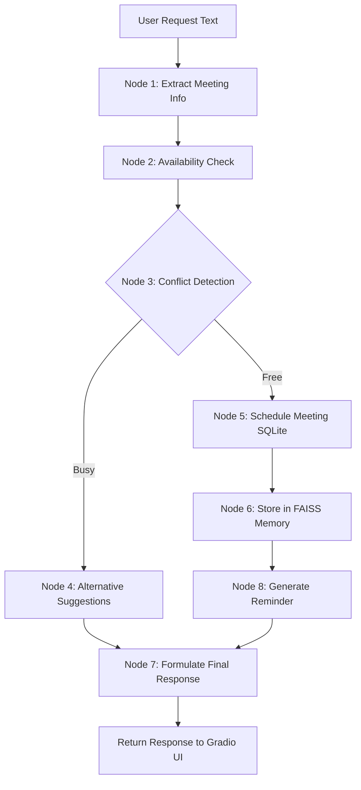

# AI Meeting Scheduler Agent 🗓️🤖

A production-ready, modular scheduling system powered by a **CrewAI** multi-agent team, orchestrated via **LangGraph**, backed by an **SQLite** database, and semantic memory search using **FAISS** with local **HuggingFace Embeddings**.

---

## 🏗️ Architecture Flow



### CrewAI Multi-Agent Breakdown
1. **Meeting Scheduler Agent**: Parses conversational requests to extract metadata (who, when, what, and duration).
2. **Availability Checker Agent**: Reviews attendee calendars in SQLite to verify availability.
3. **Conflict Resolver Agent**: Proposes alternative slots if overlaps occur.
4. **Reminder Agent**: Formulates clear notification alerts.
5. **Calendar Manager Agent**: Commits scheduling transactions to the database.

---

## 🛠️ Tech Stack & Directory Structure

```
meeting_scheduler_agent/
├── app.py                      # Application entrypoint
├── requirements.txt            # Python dependencies
├── README.md                   # Setup and deployment documentation
├── .env                        # Environment variables
│
├── frontend/
│   ├── ui.py                   # Gradio blocks UI layout
│   ├── theme.py                # Visual style configurations
│   └── assets/
│       ├── styles.css          # Custom styling sheet
│       └── logo.png            # Generated application logo
│
├── backend/
│   ├── scheduler.py            # Unified backend workflow driver
│   ├── calendar_manager.py     # Calendar database client
│   ├── availability_checker.py # Slot collision checks
│   ├── conflict_resolver.py    # Search for alternative slot options
│   └── reminder_service.py     # Notification generation and processing
│
├── agents/
│   ├── scheduler_agent.py      # CrewAI scheduler agent definition
│   ├── availability_agent.py   # CrewAI availability auditor definition
│   ├── conflict_agent.py       # CrewAI conflict resolver definition
│   ├── reminder_agent.py       # CrewAI reminder specialist definition
│   ├── calendar_agent.py       # CrewAI calendar manager definition
│   └── crew.py                 # Multi-agent crew structures
│
├── workflows/
│   ├── graph.py                # LangGraph state workflow wiring
│   └── state.py                # LangGraph schema definitions
│
├── llm/
│   ├── model_loader.py         # Swappable model loading (Groq, Gemini, Ollama, Mock)
│   └── prompts.py              # Prompt definitions and agent system roles
│
├── vectorstore/
│   ├── faiss_db.py             # LangChain FAISS memory client
│   └── meeting_memory/         # Directory holding FAISS index files
│
└── database/
    ├── db.py                   # SQLite tables setup and query operations
    └── meetings.db             # Database file (generated on start)
```

---

## 🚀 Local Setup & Installation

### 1. Prerequisite
- Python 3.8 to 3.11 installed.

### 2. Clone and Initialize Virtual Environment
Open terminal in the root project folder:
```bash
python -m venv venv
# On Windows (PowerShell)
.\venv\Scripts\Activate.ps1
# On Linux/macOS
source venv/bin/activate
```

### 3. Install Dependencies
```bash
pip install -r requirements.txt
```

### 4. Configure Environment Variables
Open the `.env` file and set the `LLM_PROVIDER` and corresponding API keys:
```ini
# Supported: mock, groq, gemini, openai, ollama
# Default 'mock' uses local rule-based parsing so the app runs without keys.
LLM_PROVIDER=mock

# Set the key for the provider you choose (e.g. Groq)
GROQ_API_KEY=gsk_your_key_here
MODEL_NAME=gemma2-9b-it
```

### 5. Launch the Application
```bash
python app.py
```
Open [http://127.0.0.1:7860](http://127.0.0.1:7860) in your web browser.

---

## 🤖 Switchable Model Support

The model loader (`llm/model_loader.py`) supports 5 providers, which you select by setting the `LLM_PROVIDER` env variable:

| LLM_PROVIDER | Default MODEL_NAME | Required Env Variable | Description |
|---|---|---|---|
| `mock` | `mock-scheduler-llm` | *None* | Runs locally on CPU; uses smart rule-based regex parsing for testing. |
| `groq` | `gemma2-9b-it` / `llama3-8b-8192` | `GROQ_API_KEY` | Connects to high-performance open weight endpoints on Groq. |
| `gemini` | `gemini-2.5-flash` | `GEMINI_API_KEY` | Utilizes Google's Gemini LLM. |
| `openai` | `gpt-4o-mini` | `OPENAI_API_KEY` | Utilizes OpenAI GPT models. |
| `ollama` | `gemma:2b` / `llama3` | *Ollama running locally* | Fully local LLM execution. |

---

## 🎨 Professional Gradio UI Features
- **Gradio Chatbot**: Accepts natural language scheduling requests.
- **Active Calendar Events**: A table displaying scheduled database entries.
- **Vector Meeting Memory**: Semantic lookup on meeting summaries stored in FAISS (no SQL exact-match required!).
- **Reminders Panel**: View and test notifications. Click **"Check & Process Reminders"** to transition status from `PENDING` to `SENT`.
- **Activity Log Stream**: Direct log trace of the LangGraph nodes executing.

---

## 🌐 Deployment Guidelines

### 1. Hugging Face Spaces (Gradio)
Hugging Face Spaces natively supports Gradio deployments:
1. Create a new Space on [Hugging Face](https://huggingface.co/spaces) and select **Gradio** as the SDK.
2. Structure your Space repository so that `app.py` is at the root. (Copy the files from `meeting_scheduler_agent` directly to the root of your Hugging Face space repository).
3. Set your secret API keys (like `GROQ_API_KEY` or `GEMINI_API_KEY`) under **Space Settings -> Repository Secrets**.
4. HF Spaces automatically builds and runs the Gradio interface using the dependencies declared in `requirements.txt`.

### 2. Render
Deploy as a Docker or Python Web Service:
1. Create a web service on [Render](https://render.com).
2. Connect your GitHub repository.
3. Configure the settings:
   - **Environment**: `Python`
   - **Build Command**: `pip install -r requirements.txt`
   - **Start Command**: `python app.py` (ensure `PORT` is bound to Render's default environment PORT variable).
4. Add Environment Variables (`LLM_PROVIDER`, `GROQ_API_KEY`, `PORT=10000`, `HOST=0.0.0.0`) in Render settings.

### 3. GitHub
To store the project on GitHub:
1. Run `git init` in the `meeting_scheduler_agent` folder.
2. Create a `.gitignore` containing:
   ```
   venv/
   .env
   __pycache__/
   *.log
   database/*.db
   vectorstore/meeting_memory/*
   ```
3. Commit and push your code to your remote GitHub repository.
